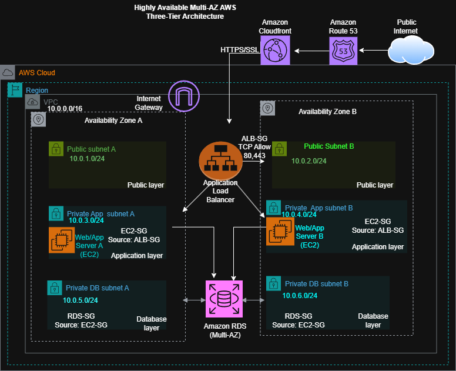

# Terraform AWS Highly Available Three-Tier Architecture

## Project Overview

This project demonstrates the design and Infrastructure as Code (IaC) implementation of a highly available AWS three-tier architecture using Terraform.

The architecture follows AWS best practices by separating resources into presentation, application, and database layers across multiple Availability Zones for fault tolerance and high availability.

## Architecture Components

* Amazon VPC
* Public and Private Subnets
* Internet Gateway
* Application Load Balancer (ALB)
* Auto Scaling Group
* Amazon EC2
* Amazon RDS Multi-AZ
* Amazon Route 53
* Amazon CloudFront
* Security Groups
* Terraform

## Architecture Diagram

## Network Design

| Resource             | CIDR        |
| -------------------- | ----------- |
| VPC                  | 10.0.0.0/16 |
| Public Subnet A      | 10.0.1.0/24 |
| Public Subnet B      | 10.0.2.0/24 |
| Private App Subnet A | 10.0.3.0/24 |
| Private App Subnet B | 10.0.4.0/24 |
| Private DB Subnet A  | 10.0.5.0/24 |
| Private DB Subnet B  | 10.0.6.0/24 |

## Security Design

* ALB Security Group allows HTTP (80) and HTTPS (443)
* EC2 Security Group allows traffic only from ALB
* RDS Security Group allows traffic only from EC2

## Availability and Resilience

* Multi-AZ deployment
* Load-balanced application layer
* Auto Scaling for EC2 instances
* Highly available database layer
* Global content delivery through CloudFront

## Tools Used

* Terraform
* AWS
* Draw.io

## Author

Fadila Yiddana
AWS Cloud Engineer
