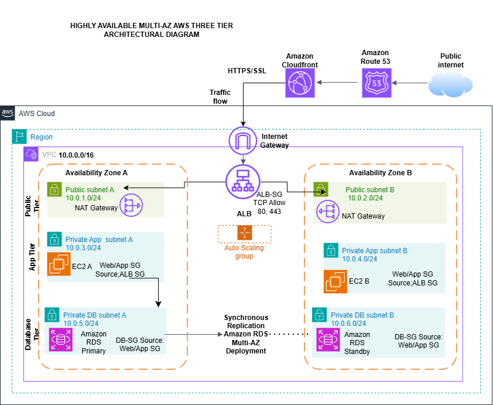

# Terraform AWS Highly Available Three-Tier Architecture

A Terraform project demonstrating the design and implementation of a highly available, multi-tier AWS architecture following Infrastructure as Code (IaC) best practices.

---

## Project Overview

This project demonstrates how Terraform can be used to provision a highly available three-tier architecture on AWS.

The infrastructure separates the presentation, application, and database layers into dedicated tiers distributed across multiple Availability Zones to improve scalability, fault tolerance, and resilience.

The project follows AWS Well-Architected design principles and demonstrates enterprise cloud infrastructure commonly used in production environments.

---

## Architecture

The diagram below illustrates the high-level architecture of the AWS highly available three-tier application, showing how traffic flows securely through the presentation, application, and database layers across multiple Availability Zones.



*Figure: Highly available AWS three-tier architecture deployed across multiple Availability Zones using Terraform.*


---

## Architecture Flow

Client

↓

Application Load Balancer (public subnets)

↓

Auto Scaling Group (Amazon EC2, private app subnets)

↓

Amazon RDS Multi-AZ (private db subnets, no internet route)

---

Amazon Route 53 and Amazon CloudFront are planned additions — see **Future Improvements** below. They are not yet implemented in this code.

---

## AWS Services Used

| AWS Service               | Purpose                                                |
| ------------------------- | ------------------------------------------------------ |
| Amazon VPC                | Isolates the network environment                       |
| Public, Private App & Private DB Subnets | Three-tier network isolation across 2 AZs |
| Internet Gateway          | Public subnet internet access                          |
| NAT Gateway                | Outbound-only internet access for the app tier         |
| Application Load Balancer | Distributes incoming traffic                           |
| Auto Scaling Group        | Automatically scales EC2 instances                     |
| Amazon EC2                | Hosts the application layer                            |
| IAM Role & Instance Profile | SSM Session Manager access, no open management ports |
| Amazon RDS Multi-AZ       | Provides highly available relational database services |
| Security Groups           | Controls network access between tiers                  |
| S3 + DynamoDB (backend)   | Remote Terraform state storage and locking              |
| Terraform                 | Infrastructure as Code provisioning                    |

---

## Network Design

| Resource             | CIDR Block  |
| -------------------- | ----------- |
| VPC                  | 10.0.0.0/16 |
| Public Subnet A      | 10.0.1.0/24 |
| Public Subnet B      | 10.0.2.0/24 |
| Private App Subnet A | 10.0.3.0/24 |
| Private App Subnet B | 10.0.4.0/24 |
| Private DB Subnet A  | 10.0.5.0/24 |
| Private DB Subnet B  | 10.0.6.0/24 |

---

## Security Design

* Application Load Balancer accepts HTTP (80) and HTTPS (443) traffic.
* EC2 instances accept traffic only from the Application Load Balancer.
* Amazon RDS accepts database traffic only from the application layer.
* Network isolation is achieved using public and private subnets.
* Security Groups enforce least-privilege access between tiers.

---

## High Availability Features

* Multi-AZ deployment
* Public and private subnet architecture
* Application Load Balancer
* Auto Scaling Group
* Amazon RDS Multi-AZ
* Fault-tolerant network design
* Infrastructure as Code using Terraform

---
## Repository Structure


├── diagrams/
│   └── highly-available-three-tier-architecture.png


terraform/

├── modules/

   ├── networking/     # VPC, subnets, IGW, NAT Gateway, route tables

     ├── main.tf

      ├── variables.tf

   │   └── outputs.tf
   

  ├── compute/        # Security groups, IAM/SSM, launch template, ASG, ALB

      ├── main.tf

      ├── variables.tf

     └── outputs.tf
     

   └── database/       # RDS security group, subnet group, RDS instance

      ├── main.tf

     ├── variables.tf

     └── outputs.tf


├── main.tf              # Wires the three modules together

├── variables.tf

├── outputs.tf

├── locals.tf

├── provider.tf

├── versions.tf           # Includes S3 remote backend

├── backend.hcl.example

├── terraform.tfvars.example

└── .gitignore


---

## Project Status

| Component                     | Status                                              |
| ------------------------------ | --------------------------------------------------- |
| Repository Created             | ✅                                                    |
| Architecture Diagram           | ✅                                                    |
| Modular Terraform Structure    | ✅ (networking / compute / database modules)         |
| VPC & Network Isolation Design | ✅ (public / private-app / private-db tiers)         |
| Security Groups & IAM/SSM      | ✅                                                    |
| Application Load Balancer      | ✅                                                    |
| Auto Scaling Configuration     | ✅ (includes user_data web server bootstrap)         |
| Amazon RDS Multi-AZ Design     | ✅                                                    |
| Remote State (S3 Backend)      | ✅ (configured, not yet initialized against a live bucket) |
| Terraform Validation           | ✅ `terraform validate` passes on full project        |
| Live Deployment                | ⏳ Previously deployed and validated in a temporary AWS training/sandbox environment; not currently live |
---

## Skills Demonstrated

* Infrastructure as Code (Terraform)
* Terraform Variables
* Terraform Outputs
* Terraform Data Sources
* Terraform Locals
* Terraform State Management
* Modular Terraform File Organization
* AWS Networking
* Amazon VPC
* Auto Scaling
* Application Load Balancer
* Amazon RDS
* Cloud Security
* AWS Well-Architected Framework

---

## Future Improvements

* Add AWS WAF
* Implement CI/CD with GitHub Actions
* Enable centralized logging with Amazon CloudWatch
* Configure AWS Backup
* Add monitoring and alerting
* Refactor infrastructure into reusable Terraform modules

---


## Prerequisites


* Terraform v1.5 or later
* AWS CLI configured
* AWS account with appropriate IAM permissions
* Git

---

## Deployment Notes

This project was developed as part of my hands-on cloud engineering portfolio using Terraform and AWS.

The infrastructure was successfully deployed and tested in a cloud training environment during my AWS training at AmaliTech Ghana. As training lab environments are temporary, the deployed resources were terminated after each lab session expired.

The Terraform configuration is deployment-ready and can be provisioned in any AWS account with valid credentials:

```bash
git clone https://github.com/Fadila-Yiddana/Terraform-aws-highly-available-three-tier-architecture.git
cd Terraform-aws-highly-available-three-tier-architecture/terraform

# Set up your backend config (see backend.hcl.example) and initialize
terraform init -backend-config=backend.hcl

# Set up your variables (see terraform.tfvars.example)
cp terraform.tfvars.example terraform.tfvars

# Set the database password as an environment variable - never in a file
export TF_VAR_db_password="your-password-here"

terraform plan
terraform apply
```

